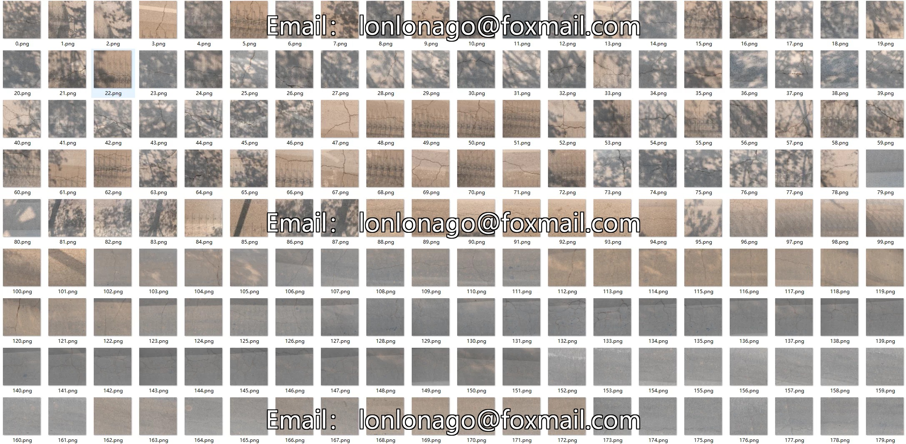
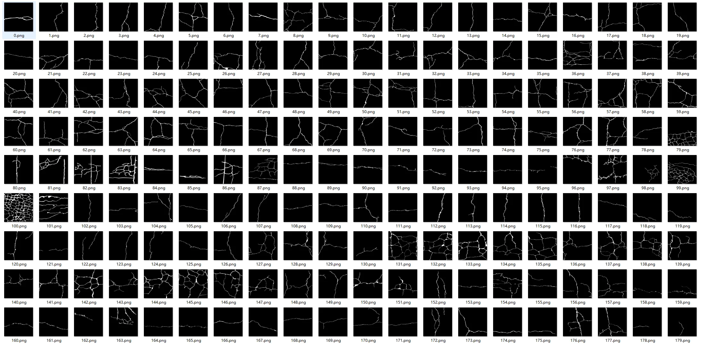

## Body

High-Speed Road Crack Detection Dataset

1500 high-speed road images captured by a multifunctional road inspection vehicle - including 922 crack images and 578 easily misclassified images - as well as 900 additional crack images collected under complex conditions such as shadows, stains, watermarks, and tire marks.

Original Image (JPG) + Segmentation Label (Mask) 2.93G

Data source description included.

Electronic virtual products are not returnable or exchangeable.

## Images

Here is a pay link on Stripe ( https://buy.stripe.com/3cs8yP7sY87d0vu9AB ). Please contact me lonlonago@foxmail.com after funding $89, and I will send you a complete data files , thank you!

